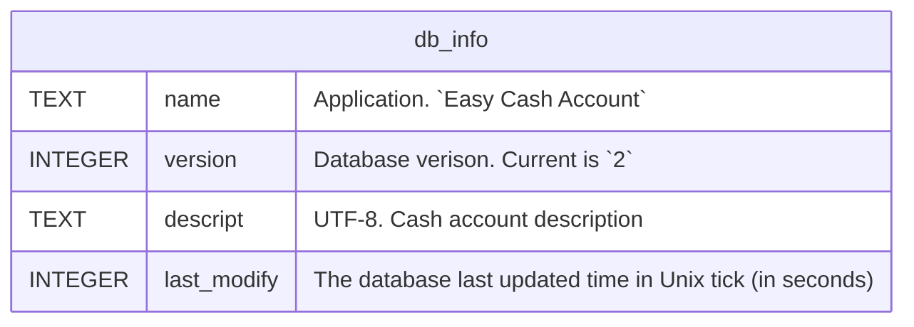
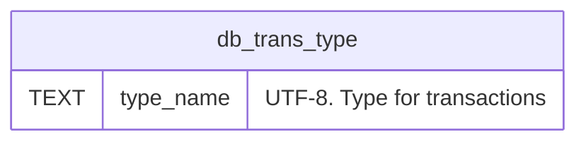
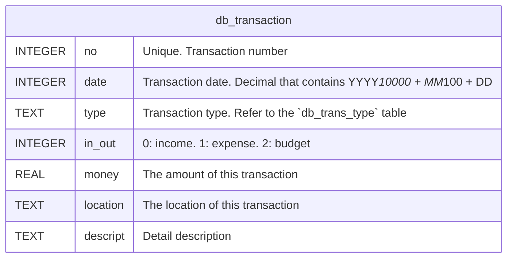

Database Schema
===============

# Database Information

# Transaction Types

# Transactions

Descriptions:

- `no`: The unique transaction identifier. Use Unix tick in seconds because users will not add more than one transaction in one second.
- `date`
    - In version 1: Unix `time_t` without time (always local 00:00:00).
    - In version 2: Date in decimal number. YYYY * 10000 + MM * 100 + DD.

